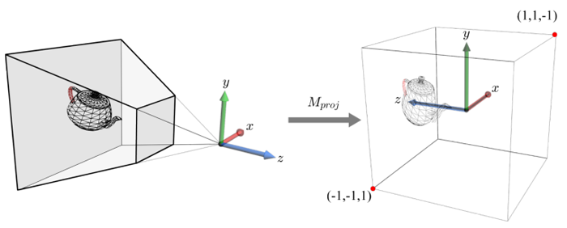

# Question <!-- Slide 2 -->
{height=100} \ {height=100} \ {height=100}

# Trivial solution <!-- Slide 3 -->
If you have some 3D points with the coordinates $(x, y, z)$, you may be tempted to project them onto the screen at the coordinates $(x, y)$. This is called an orthographic projection. See (a).

{height=170}

# Perspective drawing <!-- Slide 4 -->
{height=200}

# What does the computer know? <!-- Slide 5 -->
The computer knows nothing but numbers. The computer doesn't know what a shape is, what geometry is. We need to turn our shapes into numbers, give it to the computer, and turn the numbers back into shapes.

{height=125} \ {height=125}

# Linear algebra <!-- Slide 6 -->
Equations:

$2x - 3y = 4$  
$3x - 5y = -1$

Matrix and vectors:

$\begin{bmatrix}2 & -3 \\ 3 & -5\end{bmatrix}
\begin{bmatrix}x \\ y\end{bmatrix}= 
\begin{bmatrix}4 \\ -1\end{bmatrix}$

# Matrix multiplication <!-- Slide 7 -->
Improvements like these are called *optimizations*. 

{height=150} \ {height=150}

Add one then square it: $(x + 1)^2$  

Square it then add one: $x^2 + 1$

# Points in 3 dimensions <!-- Slide 8 -->
{height=200} \ {height=200}

# 3D objects <!-- Slide 9 -->
{height=250}

# Vanishing points <!-- Slide 10 -->
{height=250}

# Matrix 1: Model matrix <!-- Slide 11 -->
The model matrix is composed of multiple parts:

Rotation matrix: $\begin{bmatrix}\cos(\theta) & -\sin(\theta) \\ \sin(\theta) & \cos(\theta)\end{bmatrix}$

Translation: $\begin{bmatrix}T_x \\ T_y \\ T_z\end{bmatrix}$

Scaling: $\begin{bmatrix}S & 0 & 0 \\ 0 & S & 0 \\ 0 & 0 & S\end{bmatrix}$

# Matrix 1: Model matrix: Rotation matrix <!-- Slide 12 -->
$\begin{bmatrix}\cos(\theta) & -\sin(\theta) \\ \sin(\theta) & \cos(\theta)\end{bmatrix}$

This is only the rotation matrix in two dimensions. 3 dimensions:

$R_x(\theta) = \begin{bmatrix}
	1 & 0 & 0 \\
	0 & \cos(\theta) & -\sin(\theta) \\
	0 & \sin(\theta) & \cos(\theta)
\end{bmatrix}$

$R_y(\theta) = \begin{bmatrix}
	\cos(\theta) & 0 & \sin(\theta) \\
	0 & 1 & 0 \\
	-\sin(\theta) & 0 & \cos(\theta)
\end{bmatrix}$

$R_z(\theta) = \begin{bmatrix}
	\cos(\theta) & -\sin(\theta) & 0 \\
	\sin(\theta) & \cos(\theta) & 0 \\
	0 & 0 & 1
\end{bmatrix}$

# Matrix 1: Model matrix <!-- Slide 13 -->
Combine them, you get something like this:

$\begin{bmatrix}R & R & R & T_x \\ R & R & R & T_y \\ R & R & R & T_z \\ 0 & 0 & 0 & 1\end{bmatrix}$

Usually the bottom row is left alone.

$R = R_xR_yR_zS$

# Matrix 2: View matrix <!-- Slide 14 -->
Represents the camera rotation.

$MM^{-1} = I$

$xx^{-1} = 1$

# Viewing frustum <!-- Slide 15 -->
{height=250}

# Matrix 3: Projection matrix <!-- Slide 16 -->
{height=125} \ 
$\begin{bmatrix}
\frac{n}{W} & 0 & 0 & 0 \\
0 & \frac{n}{H} & 0 & 0 \\
0 & 0 & -\frac{f+n}{f-n} & \frac{-2fn}{f-n} \\
0 & 0 & -1 & 0\end{bmatrix}$ Assuming symmetry.

W: width, H: height, n: near plane, f: far plane.

# Entire transformation <!-- Slide 17 -->
$V_{clip} = PM_c^{-1}M_oV$

Perspective division:

$\begin{bmatrix}\frac{x}{w} \\ \frac{y}{w} \\ \frac{z}{w} \\ 1\end{bmatrix}$

Finally,

$\begin{bmatrix}\frac{x}{z} \\ \frac{y}{z} \\ 1\end{bmatrix}$

We now know where the points are on the screen.

# Entire transformation <!-- Slide 18 -->
{width=400}

# Why matrices? <!-- Slide 19 -->

# <!-- Slide 20 -->
## Part 2: Implementation

# C programming language <!-- Slide 21 -->
This code is unsafe.
```c
#include <stdio.h>

int main() {
    char buffer[10];
    
    printf("Enter a string: ");
    scanf("%s", buffer);
    
    printf("You entered: %s\n", buffer);
    
    return 0;
}
```

# Structure <!-- Slide 22 -->
{height=250}

# Writing process <!-- Slide 23 -->
```c
typedef struct {
    float m[4];
} t_Point;

typedef struct {
    float m[4][4];
} t_Matrix;

typedef struct {
    t_Point p1;
    t_Point p2;
    t_Point p3;
    t_Point normal;
} t_Face;
```

# Writing process <!-- Slide 24 -->
Line by line, token by token.

# Writing process <!-- Slide 25 -->
```c
void t_multiMM(t_Matrix* m1, t_Matrix* m2, t_Matrix* out);
void t_multiMV(t_Matrix* m1, t_Point* v1, t_Point* out);
void t_rotate(float angle, int axis, t_Matrix* out);
...
void t_genProj(t_Matrix * proj, int* w, int* h, float* FOV);
void t_genView(t_Matrix* viewMatrix, t_Model * model);
void t_genModel(t_Matrix *out, t_Model * model);
```

# Writing process <!-- Slide 26 -->
```c
if(dot_product < 0.0) {
        // This reverses the order of the points in the face
        t_Point tmp = in->p3;
        in->p3 = in->p1;
        in->p1 = tmp;
    }
```

# Writing process <!-- Slide 27 -->
```c
// 5. t_transpose
    t_Matrix transposeMatrix = testMatrix;
    t_transpose(&transposeMatrix);
    t_Matrix expectedTranspose = (t_Matrix) {{
        ... // matrix here
    }};
    int test51 = matrixcmp(&transposeMatrix, &expectedTranspose);
    if (test51) printf("5. Success\n");
```

# Writing process <!-- Slide 28 -->
```c
float FOV = 90; //default

t_genProj(&proj, &WIDTH, &HEIGHT, &FOV);
t_genModel(&model, &object);
t_genView(&view, &camera);

// Put faces in correct order
int i;
for (i = 0; i < faces_count; i++)
    t_reorderFace(&(faces[i]));
```

# What I learned <!-- Slide 29 -->
  - Perspective projection
  - Unit tests
  - Text processing
  - Command line input
  - Rasterizing

# End
To show your appreciation...